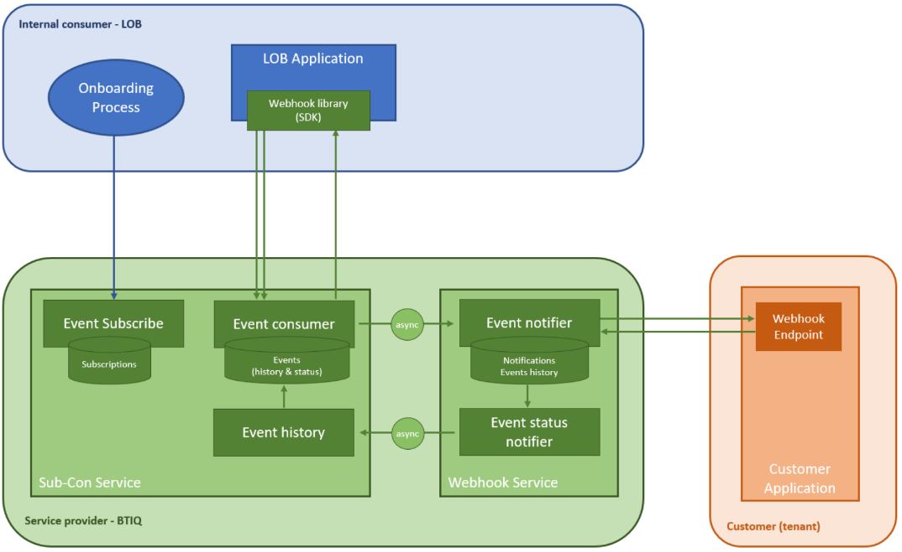

**Overview**

  * Product Benefits

  * Usecases

  * Component Parts & Microservices

  * Process Types

  * Product Onboarding

  * Customer Onboarding

The webhooks service is a standalone, contained system deployed and managed by
BTIQ that provides segments with a simple way to create subscriptions for
their customers and send them event notifications. BTIQ manages the
microservices and databases, the segment only needs to set up the
subscriptions and use the BTIQ SDK library to send events, and BTIQ takes care
of the rest.

Webhooks is a service that allows Bottomline service and application to notify
customers, their applications, and even other Bottomline applications when a
relevant event has occurred. When a customer or a disparate Bottomline
application needs to be notified of an event in real-time the webhook service
plays a key role in building the right solution. Utilizing the Webhooks
service makes it easy to create subscriptions and securely send event
notifications directly to customers via API calls.Â

**Â Â Â Â Figure: Webhooks - Subscription & Consumption**

     

# Product Benefits

**For Segments**

  * One API call per customer to set up all of their event subscriptions

  * Easy to implement library to post events

  * The CRC process allows validating the connectivity with the customer’s application

**For the end customer**

  * Secure way to be notified instantly about events they care about

  * Only subscribe to events that matter

# Usecases

**Subscribe**

Product lines can create and update subscriptions on behalf of their
customers. BTIQ generates a _secretÂ_ that is shared with the customer. BTIQ
uses the shared secret to compute a signature of the event payload that
customers can check to confirm that Bottomline is the source of the incoming
webhooks and ensure that the webhooks payload has not been modified in transit
(integrity check). The customer webhook URL must be whitelisted. A single
subscription can handle one or multiple event types. An event type can be part
of multiple subscriptions.

 How to request whitelisting a webhook URL: [Click
here](https://bottomlinetechnologies.sharepoint.com/:u:/r/sites/BTIQIntranet/SitePages/Request%20Access%20BTIQ%20Platform.aspx?csf=1&web=1&e=PwXj5s)Â
(this process can take a few days)

**Challenge Response Checks**

To verify that the customer is the owner of the webhook URL, LOBs can trigger
a Challenge Response Check (CRC) during their onboarding process or any time
they wish.

**Send events**

Applications can send events to the webhooks service, which notifies the
customer endpoints. An event can trigger 0, 1, or multiple notifications
depending on the customer's subscriptions. The Webhooks manage automatic
retries with a default behaviour (retry after 30sec, 5min, 30min, 2hrs, and
then stop) that can be changed for customer-specific needs (sum of retries
can't surpass 24hrs, can't exceed five retries).

**Exceptions management**

Product lines can get the list of notifications (for a given subscription)
with their related status. If a notification has a failed status, it can
trigger a retry.

# Component Parts & Microservices

Webhooks Service made up of:

  1. Subscription API

  2. Event Consumer API (exposed via the Webhook Library SDK)

  3. Subscription and Event database

  4. Event Notifier

# **Process Types**

## **Product Onboarding**

Product onboarding is a one-shot process done by the Bottomline product &
development team. The Bottomline development team implements the logic of
sending notifications whenever events occur (using Webhooks SDK). The
Bottomline product team documents the notifications to the customer and the
payload linked to those notifications.

_E.g., Whenever a payment is confirmed (event), we sends the PaymentIdÂ
[String], Date [DateTime], and Amount [Number]Â (format)_

## **Customer Onboarding**

Customer onboarding is a joint effort between the Bottomline implementation
team and each segment. The segment implements endpoint(s) that receives and
manages notifications.

_E.g.Â<https://customer1.com/payment-confirmed>Â manages payment
confirmations._

The Bottomline (Segment) implementation team set up the subscriptions on
behalf of the customer.

_E.g. Payment confirmations for customer1 are sent
toÂ<https://customer1.com/payment-confirmed>._

The Bottomline implementation team (Segment and Shared Platform) and the
customer collaborate to share security artefacts and run tests.

